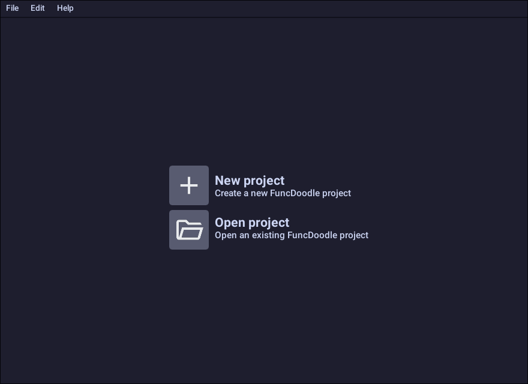
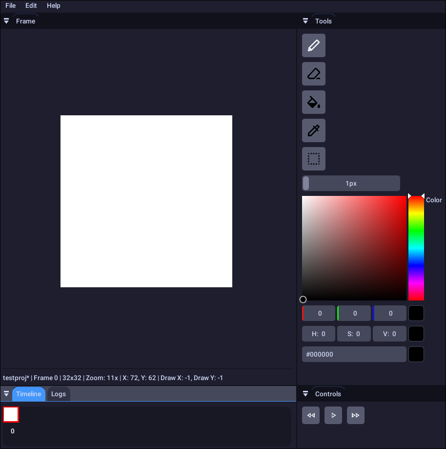

# FuncDoodle

Simple 2D frame-by-frame pixel-art animation program written in C++.

## Screenshots



## Doxygen documentation
Doxygen documentation can be generated manually by invoking
`./scripts/docs.sh`,
and is automatically generated to the
https://mangodev01.github.io/funcdoodle/doxy
github page.

## Features

This program supports:

- 🎞️ basic frame-by-frame animation
- 👀 onion-skin preview (see previous frames faintly)
- 🖼️ image import as animation frames (PNG/JPG/etc. support)
- ✏️ per-frame editing and timeline navigation
- 🖱️ basic selection tools (rectangular selection, move)
- 📄 frame duplication and deletion
- 📦 export to image sequence
- 🎬 export to .mp4 file
- 💾 project save/load system (custom project format)
- ↩️ undo/redo stack for editing actions
- 🔍 zoom and pan in canvas view
- 📏 grid overlay for pixel alignment
- 🌐 cross-platform support (Linux, macOS, Windows via CMake)
- ⌨️ keyboard shortcuts for faster workflow

---

## 🛠️ Build

### Unix (Linux / macOS)

```sh
./scripts/build.sh
```

Default flags:
- debug = true
- tiling = false
- clean = true

Override options (in order):

```sh
./scripts/build.sh [debug|release] [tiling] [clean] [run]
```

Example:

```sh
./scripts/build.sh release true false true
```

---

### Windows (CMake-based build, generator dependent)

```bat
scripts\build.bat
```

⚠️ Windows support is not heavily tested, but should work under MinGW-w64 or MSVC depending on your CMake generator.

---

## ⚡ Shell completions (Unix)

Zsh:

```sh
source scripts/completion/completion.zsh
```

Cross-compile completion:

```sh
source scripts/completion/completion_cross.zsh
```

---

## 🌍 Cross-compile (Linux/macOS → Windows)

```sh
./scripts/build_cross.sh
```

Run with no arguments to see usage.

---

## 🍎 macOS

macOS users can package FuncDoodle using the provided scripts.

First, build the project:

```sh
./scripts/build.sh
```

Then create the `.app` bundle:

```sh
./scripts/pkg_app.sh
```

Finally, generate a DMG:

```sh
./scripts/create_dmg.sh
```

This produces a distributable `.dmg` containing the application.
